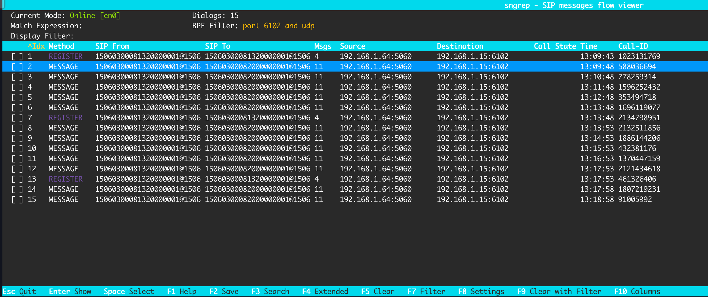
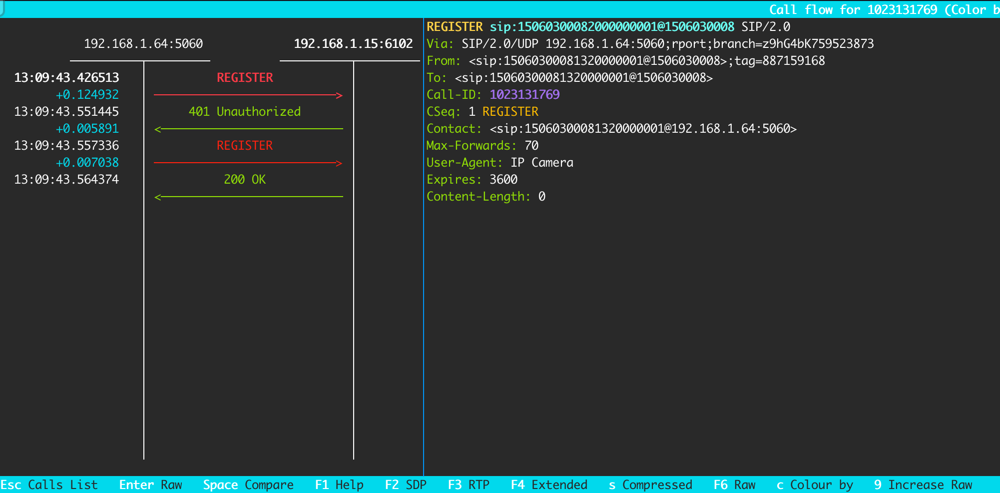

# sngrep使用

## 安装
Mac: ```brew install sngrep```

其他操作系统按照[官方说明](https://github.com/irontec/sngrep)进行安装

## 使用

### 查询网卡名称
通过```ifconfig```shell命令查询网卡名称,一般都是`eth0`,我这个是`en0`

### 启动`sngrep`
- 命令中的`en0`替换为实际网卡名称
- `6102`替换为实际SIP端口
- `udp`或`tcp`根据配置选择
- 历史数据保存在`save.pcap`文件中
```Shell
sngrep -d en0 -O save.pcap port 6102 and udp
```
会话窗口列表，**上下键**选择，**Enter**键进入详情。

`F10`选择显示字段，**空格键**勾选，其他操作看**底部提示**

注册会话详情，有时序图，**上下键**查看不同的消息详情

比起看Java日志，`sngrep`更加清晰方便

心跳保活


### 查看历史

```Shell
sngrep -I save.pcap host 192.168.1.15 and port 6102
```


