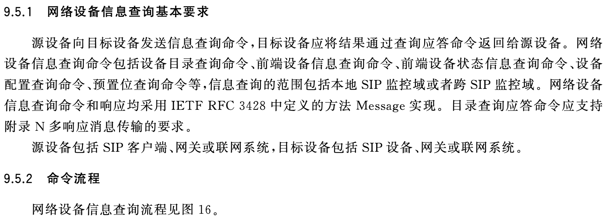
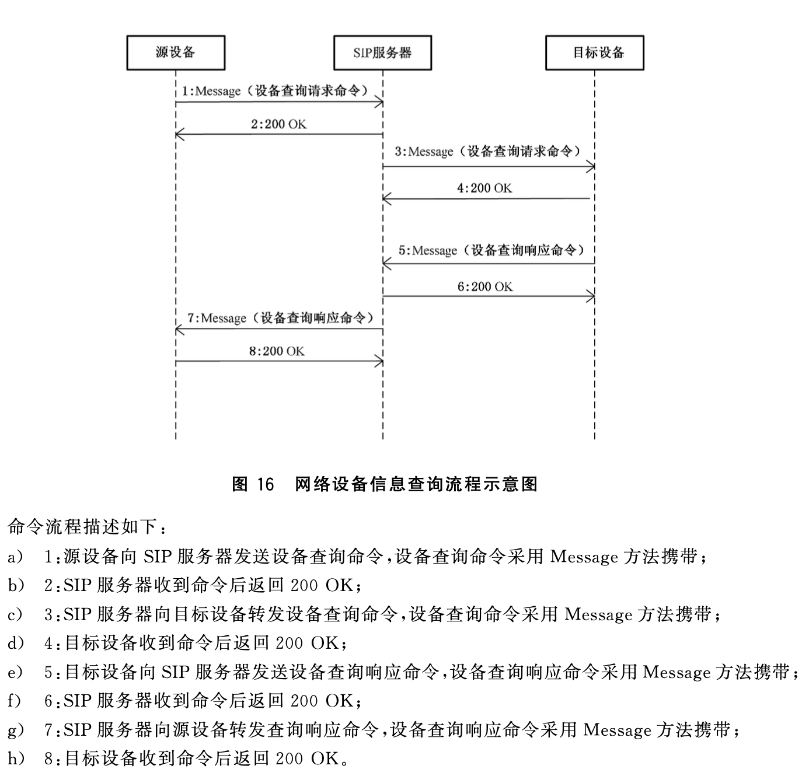
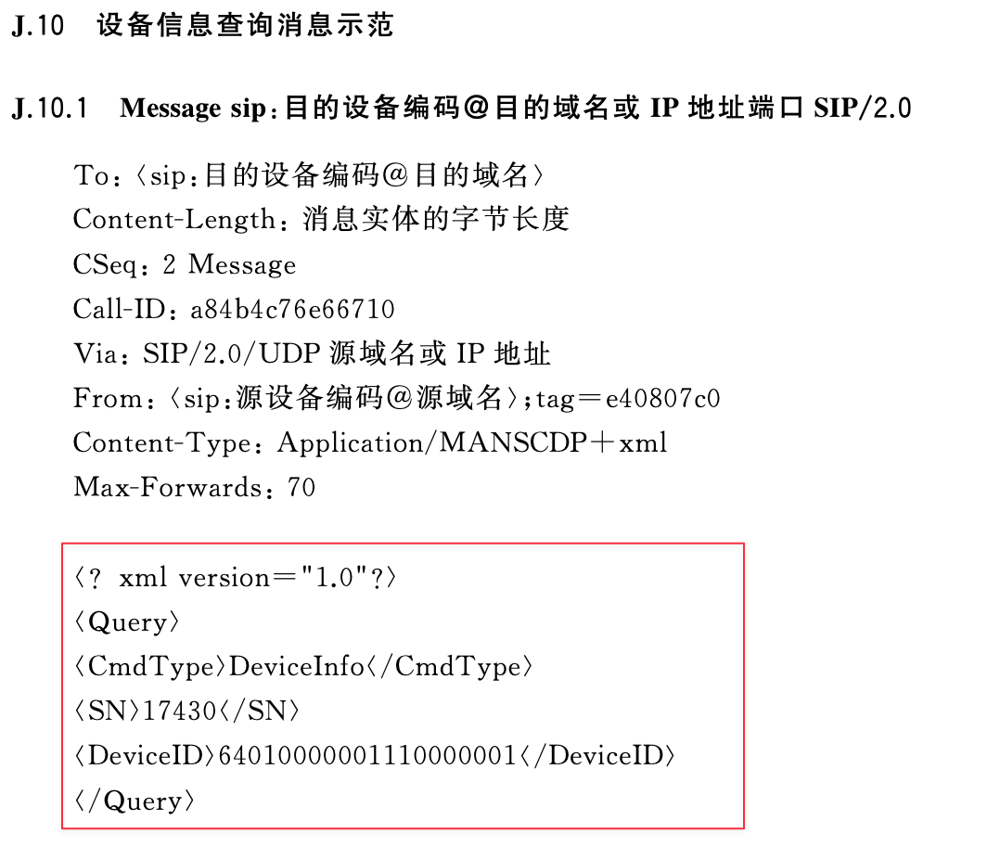
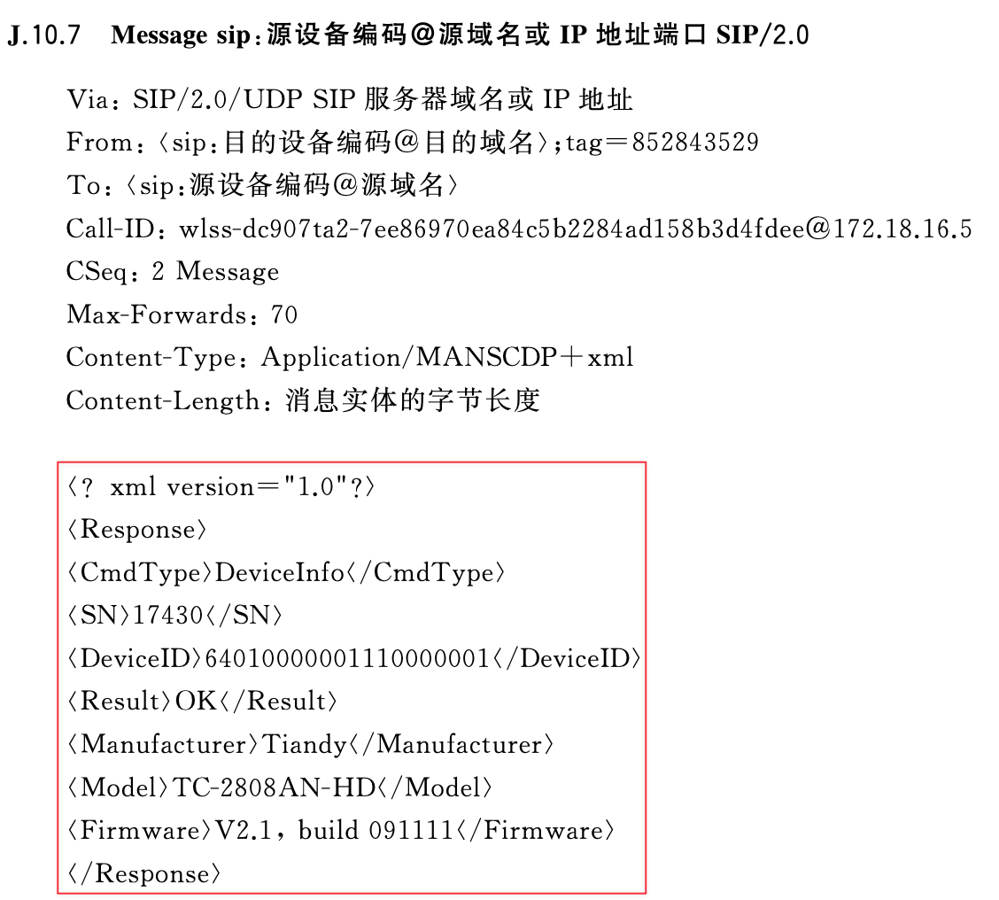

# 国标GB28181协议
[GB28181](http://c.gb688.cn/bzgk/gb/showGb?type=online&hcno=8BBC2475624A6C31DC34A28052B3923D)是一项国家标准，全称为《公共安全视频监控联网系统信息传输、交换、控制技术要求》。
这项标准主要规定了视频监控系统的互联结构,传输、交换、控制的基
本要求和安全性要求,以及控制、传输流程和协议接口等技术要求。

## 主要组成
1. **系统组成**：监控中心、传输设备、编码设备、解码设备等。
2. **信息传输**：实时视频、历史视频、报警信息等。
3. **信息交换**：设备控制、设备状态查询、设备配置等。
4. **信息控制**：设备控制、设备状态查询、设备配置等。

## 关键部分

1. **设备编码**：每个设备的唯一标识。由14位的行政区划代码和后续编号组成，用于唯一标识一个设备。
2. **信令传输**：使用**SIP**（Session Initiation Protocol，会话初始协议）进行信令传输。SIP是一个基于文本的协议，用于创建、修改和终止包括视频、音频和消息在内的会话。
3. **媒体传输**： 使用**RTP**（Real-time Transport Protocol，实时传输协议）进行媒体传输，如音频和视频。
4. **设备控制**： 使用**CSTA**（Computer Supported Telecommunications Applications，计算机支持的电信应用）进行设备控制。CSTA是一种基于XML的协议，用于描述设备的状态和控制设备的操作。

## 如何使用

例如准备开发设备信息查询功能

1. 打开国标文档[GB/T 28181-2016](gb28181-2016.md)
2. 找到**9.5 网络设备信息查询**
3. 阅读一下**9.5.1网络设备信息查询基本要求**和**9.5.2 命令流程**


4. 再查询一下具体命令是什么样，都在**附录A(规范性附录)联网系统控制描述协议(MANSCDP)命令集**，这里的命令描述采用[XML Schema](https://www.w3school.com.cn/schema/index.asp),建议一定要了解。
5. 查询命令都在 **A.2.4 查询命令**,这里说明了所有的查询命令都是这样的格式，`elementname="Query"`标识xml标签名称是`Query`
```Plain Text
<elementname="Query">
    <complexType> 
        <sequence>
            <!-具体命令内容-> 
        </sequence>
    </complexType> 
</element> 
```
对应的xml应该是
```xml
<Query>
    <!-具体命令内容->
</Query>
```
6. 找到 **c) 设备信息查询请求**
这是xml描述,`fixed="DeviceInfo"`代表xml标签`<CmdType>`的值**固定**是`DeviceInfo`
```tPlain Text
<! - 命令类型:设备信息查询(必选)-> 
<elementname="CmdType" fixed ="DeviceInfo"/>
<! - - 命 令 序 列 号 (必 选 )- ->
<elementname="SN" type="integer" minInclusivevalue="1"/>
<! - - 目 标 设 备 的 设 备 编 码 (必 选 )- ->
<elementname="DeviceID" type="tg:deviceIDType"/>
```
对应的xml应该是
```xml
<Query>
    <CmdType>DeviceInfo</CmdType>
    <SN>111</SN>
    <DeviceID>15060300081320000001</DeviceID>
</Query>
```
构建SIP请求时，把请求的内容设置称这个xml就可以了。Java的xml构建可以使用[JAXB](https://zhuanlan.zhihu.com/p/343893930)，可以方便的将Java对象转为xml。

7. 也可以找到消息示范查看，在 **附录J (规范性附录) 信令消息示范** 的 **J.10设备信息查询消息示范**

发送消息示范

响应消息示范


同理可以完成 `设备心跳查询` `设备目录查询`等


[更多资料](../data/README.md)