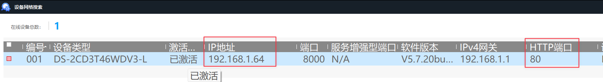
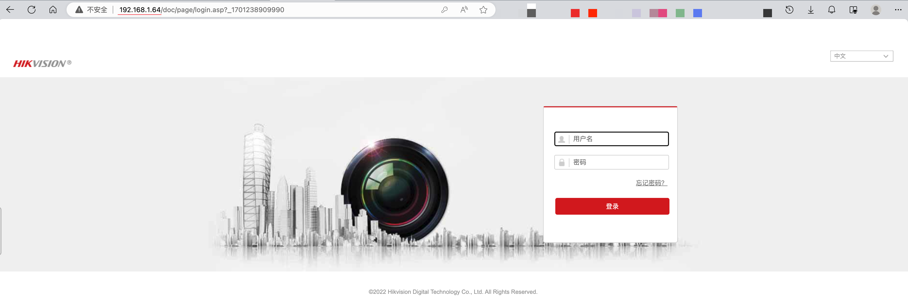
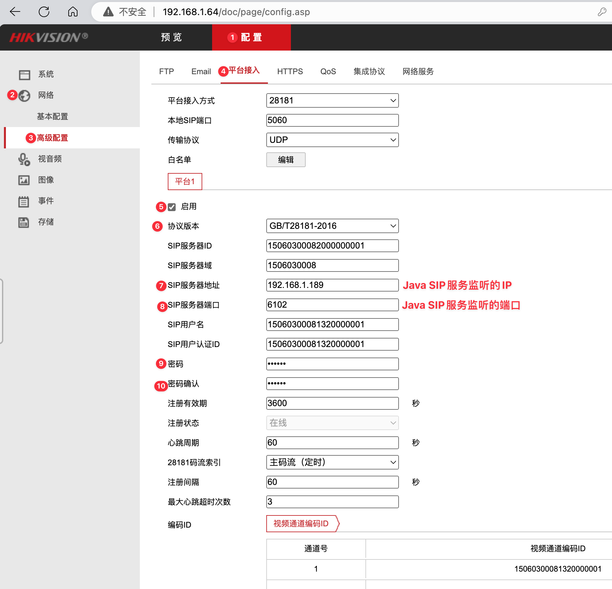
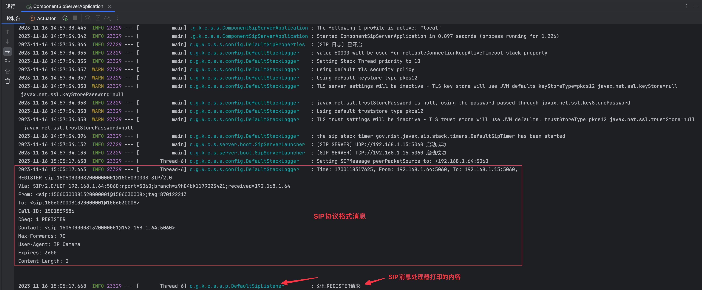

# 快速开始

- **硬件设备**: 海康网络摄像机 (型号:DS-2CD3T46WDV3-L)
- **软件**: [海康设备网络搜索工具](https://www.hikvision.com/cn/support/tools/hitools/clea8b3e4ea7da90a9/)
1. 保证Java服务和摄像头**网络互通** (通过互相ping或者telnet指定端口查看)
2. 通过[设备网络搜索工具](https://www.hikvision.com/cn/support/tools/hitools/clea8b3e4ea7da90a9/)搜索到网络内的摄像头IP

3. IP输入浏览器后进入摄像头配置页面。首次登陆可设置密码，最好**将密码保存下来**以免忘记。

4. 启用平台接入功能

5. 克隆项目 ```git clone https://github.com/kuweiguge/WVP-GB28181-Learning```
6. 切换到第一个分支，进入项目根目录 ```git checkout feature/feat_1_register_msg_received```
7. 修改配置 ```component-sip-server/src/main/resources/application-local.yml```
```yaml
sip:
  ip: 192.168.1.15 # 改为本机IP，和平台接入配置保持一致
  port: 5060
```
8. 启动项目观察日志

9. 也可以通过sip消息工具[sngrep](../data/sngrep.md)来查看sip日志，更加清晰方便。
10. 暂时没有摄像头的话，可以使用[sipp](../data/sipp.md)工具来模拟。