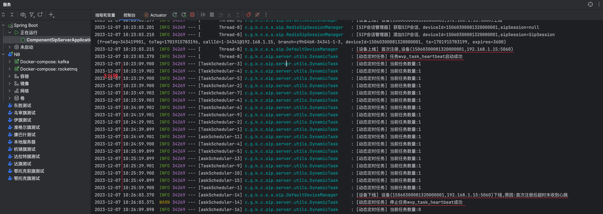
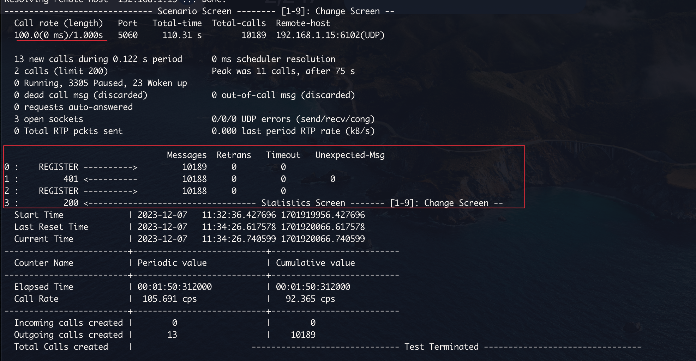

# 注册流程

:::tip
`192.168.1.64:5060`是摄像头，`192.168.1.15:6102`是Java的SIP服务器

图片中的SIP消息查看工具是[sngrep](../data/sngrep.md)
:::

**命令流程描述如下:**

1. 源设备向SIP服务器发送**设备状态信息报送命令**。设备状态信息报送命令采用 Message方法携带;
2. SIP服务器收到命令后返回200OK。

## 流程图

设备向SIP服务器发送设备状态信息报送命令

SIP服务器收到命令后返回200OK


## 国标 9.6.1 状态消息报送基本要求

* 当源设备(包括网关、SIP设备、SIP客户端或联网系统)发现工作异常时,应立即向本 SIP监控域的SIP服务器发送状态信息;
* 无异常时,应定时向本SIP监控域的SIP服务器发送状态信息。
* SIP设备宜在状态信息中携带故障子设备描述信息。状态信息报送采用IETFRFC 3428中定义的方法 Message实现。
* 通过周期性的状态信息报送,实现注册服务器与源设备之间的状态检测即心跳机制。
* 心跳发送方、接收方需**统一配置“心跳间隔”参数**,按照“心跳间隔”定时发送心跳消息,**默认心跳间隔60s**。
* 心跳发送方、接收方需**统一配置“心跳超时次数”参数**,心跳消息连续超时达到“心跳超时次数” 则认为对方下线,**默认心跳超时次数3次
  **。
* 心跳接收方在心跳发送方上线状态下**检测到心跳消息连续超时达到商定次数**则认为心跳发送方**离线**;
* 心跳发送方在心跳接收方上线状态下检测到心跳消息响应消息连续超时达到商定次数则认为心跳接收方离线。

## 代码测试

1. 切换到心跳分支

```Shell
git ckeckout feature/feat_4_keepalive
```

2. 进入`component-sip-server/src/main/resources/sipp`目录,使用[sipp](../data/sipp.md)进行模拟注册

```Shell
sipp 192.168.1.15:6102 -sf sipp_register.xml -m 1 -ap 123456
```
注册后服务器在3次心跳间隔(默认1分钟)内收不到设备的心跳消息，则触发设备下线操作。



## 并发测试

[sipp](../data/sipp.md)模拟注册加一次心跳的脚本`sipp_register_batch.xml`

```xml
<?xml version="1.0" encoding="ISO-8859-1" ?>
<!DOCTYPE scenario SYSTEM "sipp.dtd">

<scenario name="SIP Registration batch">

    <!-- REGISTER request -->
    <send retrans="500">
        <![CDATA[
      REGISTER sip:[field0]@1506030008 SIP/2.0
      Via: SIP/2.0/[transport] [local_ip]:[local_port];rport;branch=[branch]
      From: <sip:[field0]@1506030008>;tag=[call_number]
      To: <sip:15060300081320000001@1506030008>
      Call-ID: [call_id]
      CSeq: [cseq] REGISTER
      Max-Forwards: 70
      Contact: <sip:[field0]@[local_ip]:[local_port]>
      Expires: 3600
      User-Agent: IP Camera
      Content-Length: 0
    ]]>
    </send>

    <!-- Receive 401 -->
    <recv response="401" auth="true"  next="1"/>


    <label id="1"/>

    <!-- Register, now with Authorization -->
    <send retrans="500">
        <![CDATA[
      REGISTER sip:[field0]@1506030008 SIP/2.0
      Via: SIP/2.0/UDP [local_ip]:[local_port];branch=[branch]
      From: <sip:[field0]@1506030008>;tag=[pid]9901
      To: <sip:15060300081320000001@1506030008>
      Call-ID: [call_id]
      CSeq: [cseq] REGISTER
      Max-Forwards: 70
      [field1]
      Contact: <sip:[field0]@[local_ip]:[local_port]>
      User-Agent: IP Camera
      Expires: 3600
      Content-Length: 0
    ]]>
    </send>

    <!-- Receive 200 -->
    <recv response="200"/>

    <!-- Keepalive Message -->
    <send retrans="500">
        <![CDATA[
      MESSAGE sip:15060300082000000001@1506030008 SIP/2.0
      Via: SIP/2.0/[transport] [local_ip]:[local_port];rport;branch=[branch]
      From: <sip:15060300081320000001@1506030008>;tag=[call_number]
      To: <sip:15060300082000000001@1506030008>
      Call-ID: [call_id]
      CSeq: [cseq] MESSAGE
      Content-Type: Application/MANSCDP+xml
      Max-Forwards: 70
      User-Agent: IP Camera
      Content-Length: [len]

      <?xml version="1.0" encoding="GB2312"?>
      <Notify>
      <CmdType>Keepalive</CmdType>
      <SN>[cseq]</SN>
      <DeviceID>15060300081320000001</DeviceID>
      <Status>OK</Status>
      <Info>
      </Info>
      </Notify>
    ]]>
    </send>

    <!-- Receive 200 -->
    <recv response="200"/>

</scenario>
```

生成csv文件的脚本:
```Shell
#!/bin/bash
echo "SEQUENTIAL" > reg_batch.csv
i=1000
while [ $i != 2000 ]
do
i=$(($i+1))
echo "$i;[authentication username=$i password=123456]" >> reg_batch.csv
done
```

[sipp](../data/sipp.md)命令,`-l`指定并发量
```Shell
sipp 192.168.1.15:6102 -sf sipp_register_batch.xml  -inf reg_batch.csv -l 200 -trace_msg -trace_screen -trace_err -aa
```

- 按`+`键可以增加速率，这里加到了100每秒。没有出现重传和失败的呼叫。
- 压测脚本停止后，心跳任务也逐渐正常超时停止。
- Idea启动的服务有些卡顿感。
