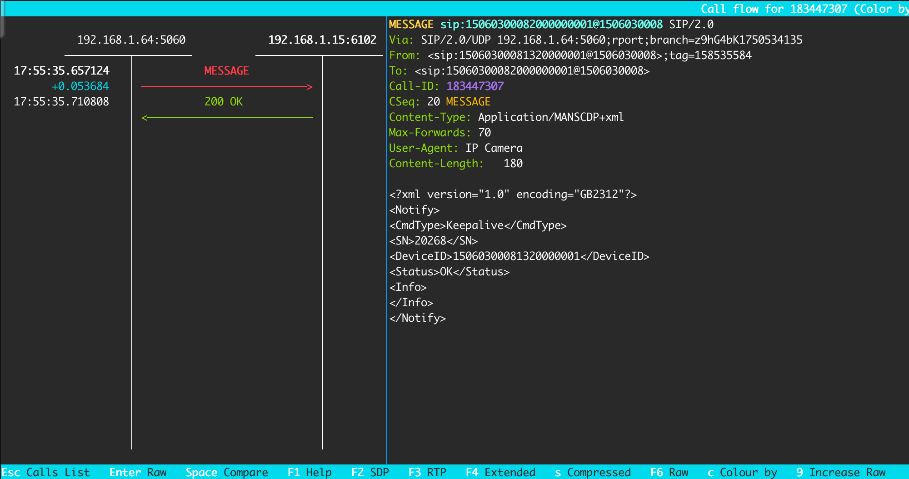
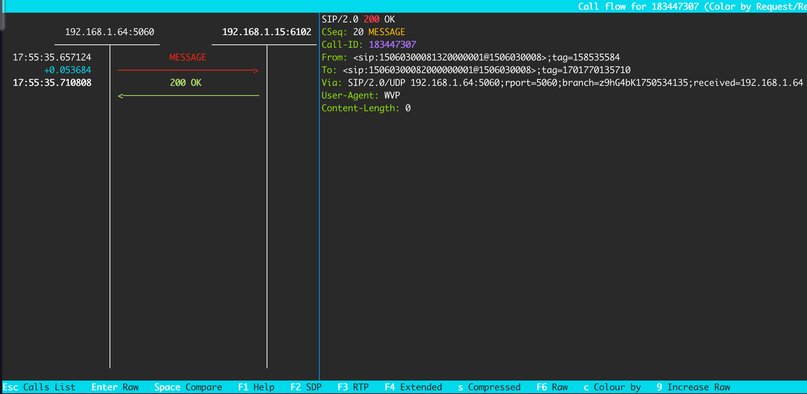

# 注册流程
:::tip
`192.168.1.64:5060`是摄像头，`192.168.1.15:6102`是Java的SIP服务器

图片中的SIP消息查看工具是[sngrep](../data/sngrep.md)
:::

**命令流程描述如下:**

1. 源设备向SIP服务器发送**设备状态信息报送命令**。设备状态信息报送命令采用 Message方法携带;
2. SIP服务器收到命令后返回200OK。

## 流程图
设备向SIP服务器发送设备状态信息报送命令

SIP服务器收到命令后返回200OK

## 国标 9.6.1 状态消息报送基本要求
当源设备(包括网关、SIP设备、SIP客户端或联网系统)发现工作异常时,应立即向本 SIP监控域的SIP服务器发送状态信息;
无异常时,应定时向本SIP监控域的SIP服务器发送状态信息。
SIP设备宜在状态信息中携带故障子设备描述信息。状态信息报送采用IETFRFC 3428中定义的方法 Message实现。
通过周期性的状态信息报送,实现注册服务器与源设备之间的状态检测即心跳机制。
心跳发送方、接收方需**统一配置“心跳间隔”参数**,按照“心跳间隔”定时发送心跳消息,**默认心跳间隔60s**。
心跳发送方、接收方需**统一配置“心跳超时次数”参数**,心跳消息连续超时达到“心跳超时次数” 则认为对方下线,**默认心跳超时次数3次**。
心跳接收方在心跳发送方上线状态下检测到心跳消息连续超时达到商定次数则认为心跳发送方离线;
心跳发送方在心跳接收方上线状态下检测到心跳消息响应消息连续超时达到商定次数则认为心跳接收方离线。