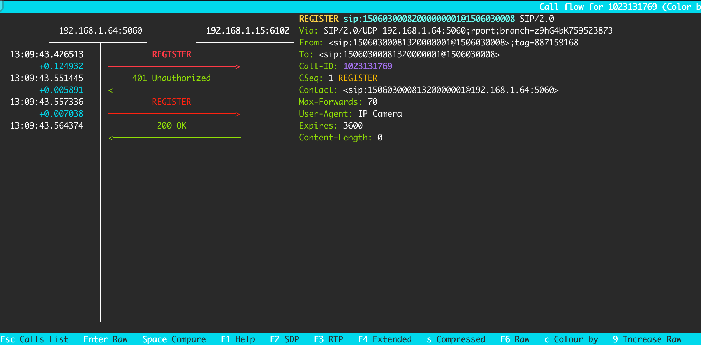
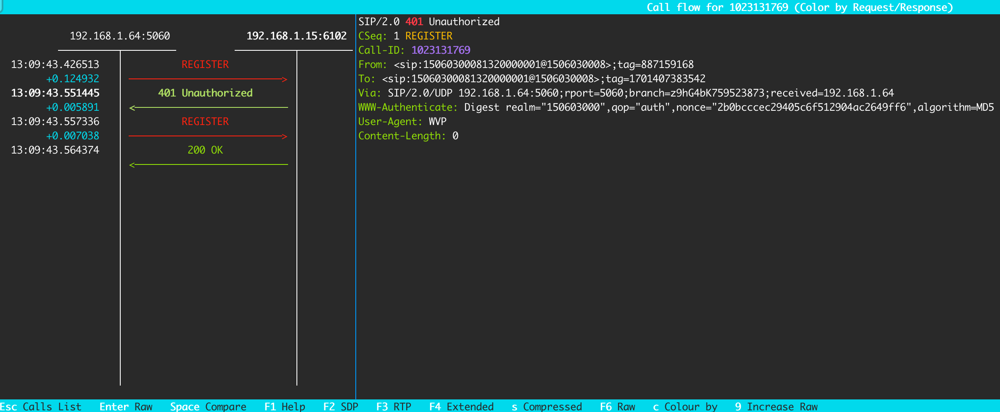
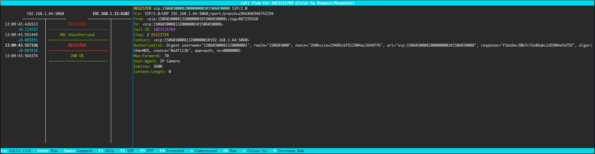
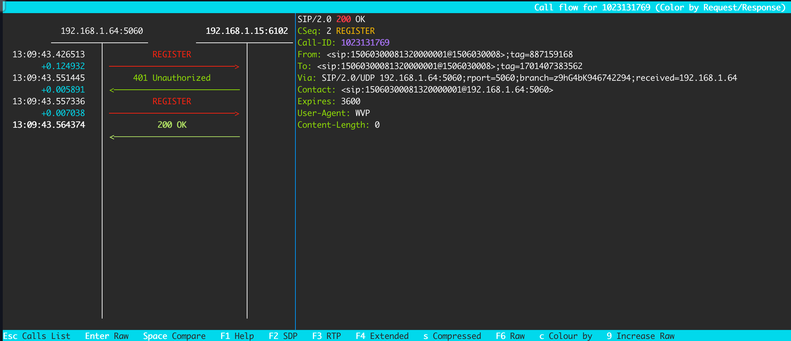

# 注册流程
:::tip
`192.168.1.64:5060`是摄像头，`192.168.1.15:6102`是Java的SIP服务器

图片中的SIP消息查看工具是[sngrep](../data/sngrep.md)
:::
## 流程图

## 流程描述
为方便理解，SIP代理简单理解为“摄像头”，SIP服务器简单理解为这个Java项目。
注册流程有以下四个步骤：
- **1.1**、摄像头向Java服务，发送`REGISTER`注册请求，此时请求中未包含`Authorization`身份认证字段；
- **1.2**、Java服务向摄像头，发送响应`401 Unauthorized`，并在响应的消息头`WWW_Authenticate`字段中给出认证方式和参数；
- **1.3**、摄像头再次向Java服务，发送`REGISTER`注册请求，在请求的`Authorization`身份认证字段中携带身份认证信息；
- **1.4**、Java服务对请求进行验证，如果检查摄像头的身份认证通过，则向摄像头发送成功响应`200 OK`，否则发送拒绝服务响应`403 Forbidden`；

## 消息示范
:::warning
注意观察整个注册流程中下面几个字段的变化规律：

Via的**branch**、From的**tag**、To的**tag**、**Call-ID**
:::
下面是四个流程的消息示范：
### 1.1 注册

### 1.2 响应`401 Unauthorized`

### 1.3 注册(带认证信息)

### 1.4 响应`200 OK`

## 概念理解
- 在[SIP协议](https://tinyurl.com/56dnbaaw)中,一个**SIP会话**可能包含多个**SIP事务**，`Call-ID`唯一标识一个**SIP会话**
- 一个**SIP事务**是由一个请求和它的所有响应组成的，**Via**的`branch`唯一标识一个**SIP事务**
- **From**的`tag`是在发起SIP会话时设置的，它与**From**中的**URL**和**Call-ID**一起，可以唯一标示一个SIP会话的一方。**它在会话中保持不变**。
- **To**的`tag`是在回复SIP响应时设置的，对于每个新的请求，在响应时都会填充一个新的`toTag`

[SIPp中文手册](https://sipp.sourceforge.net/doc/cn-reference.pdf)